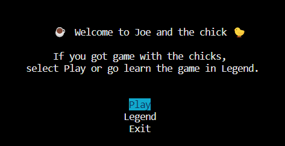
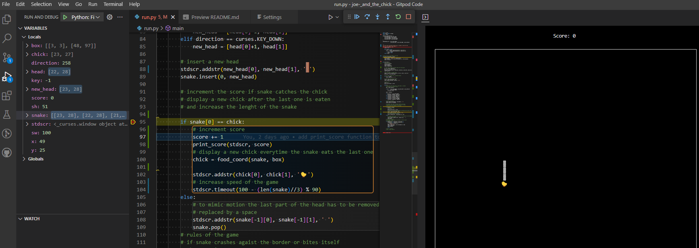

Joe and the chick is a simple snake game with level design architecture.  The game is inspired by the character of Joe Tribbiani from the world-loved series, Friends. In this game the snake plays the role of Joe, chasing chicks, eating pastrami sandwiches and well sometimes he scores and other times he just puts his foot(tail) in his mouth and gets burned. Throughout the chick chase, Joe might be tempted by a Pastrami sandwich to increase his score by two points or a hot chick but that might just lead to his demise if the chick took some self-defense classes. As Joe scores more, he will continue to the next level, where more rewards, traps, speed and barriers will appear to increase the difficulty of the game. Joe and the chicks is designed as a fun, relaxing in-bettwen thoughts and meetings type of game that boosts morals and clears the mind. The game is played on a python terminal and designed using curses, emojis and Unicode characters to construct the environment. 

# Table of Contents
## Goals
* How to play
* Visual Design
## Features
* Page Elements
* Additional Features
* Features Not Yet Implemented
## Information Architecture
* Data Models
## Technologies Used
* Languages
* Libraries
* Packages
* Platforms
* Other Tools
## Testing
* Automated Testing
* Manual Testing
* Bugs
## Deployment
* Local Deployment
* Heroku Deployment
## Credit and Developer's story
* Code
* Developer

## Goals
### How to play

This game is meant to be played in between breaks to relax, have fun and do something that doesn't require mental exhaustion and take the player's mind off a stressful day.

The game revolves around the character of Joe Tribbiani from Friends. The Snake (▓) plays the role of Joe, the ultimate player, who has to:

    * Catch a chick (🐤) to score points
    * Eat a pastrami Sandwich (🌯) to regain force and score 2 points
    * Avoid being tasered (⚡) by a chick and lose 1 point
    * Have some coffee ☕ to increase his speed
    * Stay away from barriers (▩) and borders or instant death it is
    * Abstain from biting oneself
    * Have fun!

The game is played using the following keys:
1. KEY_UP to move upward
2. KEY_DOWN to move downward
3. KEY_RIGHT to move right
4. KEY_LEFT to move left
5. Press X to exit the game
6. Press any key to return to the Menu from Legend
7. Enter to select

### Visual Design

* Menu:

 As the gamer enters the game console, he is asked to choose an item from the menu: play, legend or exit. The play button directs the gamer to start playing the game. The legend option, contains instructions on how to play the game. Finally, the exit option allows the player to stop the game. The menu items appear in the middle of the terminal and the item selected is highlighted for better visual contrast. The user is allowed to use Key down/up and enter to select menu items.

* The game:

The design of the game is clean and playful adhering to the character of Joe Tribbiani's, from Friends, personality traits. The use of emojis and Unicode characters inspires inner playfulness and encourages the player to continue playing. The game field is a pad created using curses. It displays clean visual borders for the player to not cross. Above the field, a score is displayed for the player to see his total score.
Throughout the game, messages will appear to show indicate the state of the game to the player such as, "Game Over!" or "You've got game, player! Next Level" or ask for input to exit the game.

* Emojis as a design choice:

Emoticons are widely used among the targeted players' age range of this game. Emojis are often used in communication as coded language to convey different meanings in various scenarios to various groups. Hence, their use in this game can add contextual or additional emotional meaning to the players and a fun upbeat game environment. As the game is set around the dating scene of a loveable character, the emojis represent what Joe is known for, his love for sandwiches, his chick magnetism and catchphrases.

The characters in the game are:
* Snake ▓  
* Chick 🐤
* Pastrami Sandwich 🌯 rewards 2 points
* Taser ⚡decrement 1 point
* Barrier ▩ instant death
* Coffee mug ☕ increases speed by 25%

## Features

#### Game Elements and Game Logic:

* Snake ▓ :

    The snake a.k.a Joe's initially consists of three body parts, which increase in size as the score increases hence increasing the difficulty of navigation and the risk of biting itself leading to the end of the game. The snake's coordinates are continuously tracked to avoid appearing on another item existing on the field and also to check for collision with another item, leading to a change in score or the end of the game.

* Chick 🐤:

    The chick is worth the chase as it rewards 1 point but can also hurt the score if armed. The chick will appear on the field where a spot is free and continuously reappears after being caught. 

* Taser ⚡:

    The taser is a weapon that will appear north of the chick giving the elusion that the chick is carrying it. The snake needs to navigate to the chick without touching the taser or the score will decrease by one point. However, if the score is at 0, it will remain as so. The taser is activated and then deactivated after being caught thus it will not continuously accompany the chick.

* Speed:

   The speed of the snake will increase as the score increases making it more challenging to navigate the field and catch the chick.

* Pastrami Sandwich 🌯 :

    The Sandwich is a reward that will randomly appear on free coordinates in the field for Joe to give him a booster point without increasing speed.

* Field:

    The field is a rectangular textpad created using curses. 

* Barriers:

    The barriers are specifically designed for each level. As the player increases his score, the barriers will change position and shape to create a maze-like environment. The barriers will appear in specific coordinates where neither the snake nor the other features are, to avoid a premature end of the game.

 * Coffee ☕:
    
    The coffee mug is a trap that gives Joe super speed leading to challenging navigation in the game. The speed is increased by 25%.

* The score:

    It is displayed outside of the game field and it increments every time the player scores or loses points. The score of the player also determines the level of the game.

* The level design:

    The game is designed with three levels in mind. As the player scores 5 points, he moves to the next, second level, and then third level. Each level is designed differently. The speed increases, the barrier maze changes and new items appear on the field making the game more and more challenging.
#### Additional Features
  
The menu:
    
 * Play allows the player to enter the game
 * Legend detailed instructions on how to play the game
 * Exit allows the player to end the game.
 * Cursor feature has a try block to handle terminal incompatibility by disabling the cursor
 * Functions that find item coordinates making sure it appears inside the box but not on the body of the snake
### Features Not Yet Implemented

  * Two players version (Joe and Chandler or Joe and Ross)
  * The chick moves to escape the snake
  * The taser randomly moves around the chick for better protection
  * Introduction of a rival that hinders the chick chase
  * The chick is not interested in Joe but rather Monica
  * Pause the game feature with an input
### Game logic:
* Find the link to the game logic chart [here](https://drive.google.com/file/d/16J0S_AEZp77vxeWnBqbtn2T3fxIQ4qEY/view?usp=sharing)
## Information Architecture
### Data Models

The game class is divided into three sections:

1. Initialization of the game setup and helper functions that avoid crashing the terminal

2. Menu and messages section: includes functions that will generate, print and design the menu. including a try block to handle terminal incompatibility to disable the cursor. The messages displayed to guide the player are also included in this section.

3. Game section: includes various functions that handle the logic of the game from checking coordinates availability, collision, generating and printing items, incrementing score, creating the level design and finally running the game. 

## Technologies Used
### Languages
I used Python to develop and design the game's logic.
### Libraries

* Curses : find the link [here](https://docs.python.org/3/howto/curses.html) for a detailed description. I chose to use curses, for a clear game visual design for the player and logic.
* Numpy : to install numpy, simply type in the terminal : pip3 install numpy
* Random
* Time
* Copy
### Platforms

 **Github**
 * Storing code remotely and deployment.

 **Gitpod**
 * IDE for project development.
 * Other Tools

**Wikipedia**
 * For emojis and Unicode characters 
## Bugs

### Cursor Deactivation

* Bug: Although executing properly within Gitpod, the command to disable the terminals cursor "curses.curs_set(0)" returns an error in the deployed version on Heroku, which means that the supplied Code Institute terminal implementation does not support disabling the cursor.
The cursor will therefore be visible in the deployed version of the app, while being invisible on a local or Gitpod terminal. 

* Fix: Try block to handle terminal incompatibility by disabling the cursor. If a terminal does not support invisible cursors, as the one provided in the Code-Institute template, curs_set will return an error. The try block lets the game continue without crashing.

### Chick Emoji

 * Bug: Due to the size of the chick emoji, the collision between the snake and the chick was not registered consistently. Visually the player thinks he has hit the target but computationally it did not due to the visual offset. This is due to the fact, that the chick emoji as well as many other emojis occupy two cells when drawn by the terminal, while only being linked to a single coordinate computationally.

 * Fix: This behavior was taken into account when determining if the snake ate the chick, by extending the radius of the collision detection algorithm to two cells instead of one.

### Taser

* Bug: Appears on top of other items.
* Fix: Place only if north of the chick is free.

* Bug/problem: Appeared too often and thus made the game too hard.
* Fix: Add a probability of 50% of appearance.

### General for all Emojis

* Bug: Emojis visually occupy more than one cell within the terminal, which leads to incorrect 
detection behavior.
* Fix: This terminal drawing behavior needed to be taken into account during collision detection. 

### Calculation of barrier position

* Bug: Barriers looked different depending on the online terminal and the Gitpod terminal, which was due to an incorrect calculation of the barrier position.
* Fix: Adapted the terminal position to take into account only the game field.
           
### The curses addstr function
* Bug: the curses function addstr() would on occasion crash the application if writing in the terminal failed.
* Fix: The fix was to wrap addstr() into a try block, which avoids crashing the game if addstr returns an error.

### Terminal flagged errors
* Problem: line too long (86 > 79 characters) was often flagged but since it didn't affect the program and the testing process, I chose to disable quality assurance in some cases as shown below.
* Fix : # noqa

### Heroku terminal text-size error:

* Bug: the deployed Heroku terminal could not display the full-size text without crashing.
* Solution: the text size and the coordinates had to be adjusted to fit the terminal.

## Known bugs:
### Heroku terminal crashing:
* Bug: the game sometimes crashes randomly or misprints a section of the game in the heroku terminal in a none deterministic way.
* Solution: Since the Heroku terminal misbehaves randomly but the Gitpod terminal works perfectly, I was not able to solve the issue.

## Testing
### Python Interactive Debugging:

- Logical errors and bugs were resolved using the interactive Python debugging console, to manually step through the code line by line and inspect the progression of local and global variables. E.g. to improve collision detection, between the snake and the chick due to the terminal's specific drawing behavior of emojis. 

### Manual Testing
- The game has been thoroughly tested in the local(Gitpod) terminal as well as the Heroku terminal. Error resolved in this manner was often related to the size of the text or barriers not being displayed equally in both terminals.

- For learning purposes, the menu and the object-oriented version of the game were drafted in separate files before being copied back into run.py, where development continued. The files menu.py and game.py have been deleted.

- The entire code has been validated by the CI Python Linter(PEP8 Python validator) provided by Code Institute and no errors were reported.

## Deployment

 The game was developed and deployed using the Code Institute's mock terminal for Heroku. 

 * I followed the steps provided by the Code Institute for a smooth        
     deployment, which are:
  1. Fork the python template repository
  2. Develop the initial game program
  3. Create the Heroku app
  4. Add the building backs to Python and NodeJS as instructed
  5. Link the Heroku app to the github repository Joe and the chick
  6. Deploy and then view app, proceed with developing and testing the game.

## Credit and Contact

* Code
    Part of the basic game structure using curses, has been done following a course on how to use curses provided by Nikhil Kumar Singh registred as Indian phythonista on Github and Youtube. These sections are mentioned in the code.

* Developer's story:

    Growing up, the timeless series Friends, was one of my favorites as it continuously cheered me up and thus, I wanted to bring
    the series funny moments and hilarious and unforgettable lines to the game. Joe's outgoing, half-witted personality and love of dating women (chicks) inspired me in creating and developing this chasing game. I have further plans to add other characters from Friends injecting more humor and challenges to the game. I hope you have fun playing this game if you want to reach out, I am available at douniazedbacha@gmail.com .